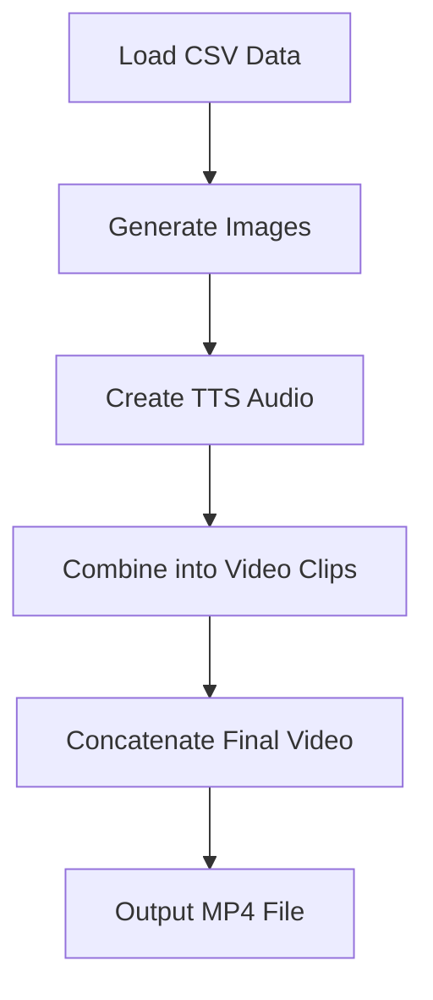

# MCQ Video Generator 🎬 ✨

> **Transform your multiple-choice questions into engaging video presentations**


## 📋 Overview

The MCQ Video Generator is a powerful tool designed to automatically convert CSV-formatted multiple-choice questions into professional video presentations with synchronized audio narration. Perfect for educators, trainers, and content creators looking to enhance learning materials without the hassle of manual video editing.

## ✨ Features

- 🎥 **Automated Video Creation** - Transform CSV files of MCQs into complete videos
- 🔊 **Text-to-Speech Narration** - Automatic audio generation for all text elements
- 🌐 **Multi-language Support** - Compatible with various languages through gTTS
- 🎨 **Customizable Styling** - Control colors, fonts, and dimensions
- 🔄 **Batch Processing** - Process multiple questions in a single run

## 🛠️ Installation

### Prerequisites

- Python 3.12 or higher
- Required font file (default: `HindVadodara-Light.ttf`)

### Setup

1. **Clone the repository**

```bash
git clone https://github.com/yourusername/mcp-video-gen.git
cd mcp-video-gen
```

2. **Install the required dependencies**

```bash
pip install -e .
# or
pip install pandas pillow gtts moviepy
```

3. **Install additional MCP dependencies**

```bash
pip install mcp[cli]>=1.6.0
```

## 🚀 Usage

### Basic Usage

```bash
python main.py
```

### As an MCP Tool

This tool is designed to work within the MCP (Machine Control Protocol) framework:

```python
from mcp.server.fastmcp import FastMCP
from main import create_mcq_video

# Create an MCP server
mcp = FastMCP("mcq_video_generator")

# Example usage
result = await create_mcq_video(
    csv_file_path="your_questions.csv",
    output_filename="my_quiz_video.mp4"
)
```

## 📊 Input Format

Your CSV file should contain columns for questions and answer options. Example format:

| Question | A | B | C | D | Answer |
|----------|---|---|---|---|--------|
| What is 1+1? | A. 1 | B. 2 | C. 3 | D. 4 | Ans: B. 2 |
| Capital of France? | A. London | B. Berlin | C. Paris | D. Rome | Ans: C. Paris |

## ⚙️ Configuration Options

| Parameter | Description | Default |
|-----------|-------------|---------|
| `csv_file_path` | Path to input CSV file | *Required* |
| `output_filename` | Name for final video | "Gyan_Dariyo_final_video.mp4" |
| `language` | Language code for TTS | "en" |
| `font_path` | Path to font file | "HindVadodara-Light.ttf" |
| `font_size` | Text size on slides | 70 |
| `img_width` | Video width (pixels) | 1920 |
| `img_height` | Video height (pixels) | 1080 |
| `bg_color_rgb` | Background color | (0, 127, 215) |
| `font_color_rgb` | Text color | (255, 255, 255) |

## 📋 Process Flow



## 🔍 Technical Details

The tool performs the following steps:
1. 📑 Reads MCQ data from a CSV file
2. 🖼️ Generates an image for each MCQ with proper text formatting
3. 🎙️ Creates audio narration using Google's Text-to-Speech (gTTS)
4. 🎞️ Combines each image and audio into individual video clips
5. 🎬 Concatenates all clips into a final video presentation

## ⚠️ Troubleshooting

### Common Issues

- **Font Not Found Error**: Ensure the specified font file exists in the working directory
- **Empty CSV Error**: Verify your CSV file contains valid data
- **Audio Generation Failure**: Check internet connection (required for gTTS)

### Font Requirements

The default font is set to "HindVadodara-Light.ttf". If you use a different font:

```python
result = await create_mcq_video(
    csv_file_path="questions.csv",
    font_path="path/to/your/font.ttf"
)
```

## 📝 License

This project is licensed under the MIT License - see the LICENSE file for details.

## 👥 Contributing

Contributions are welcome! Please feel free to submit a Pull Request.

---

Made with ❤️ for educators and content creators